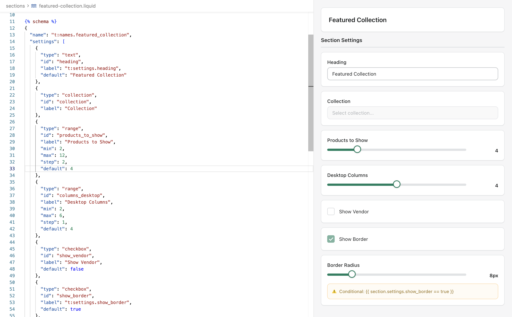

# Shopify Settings Preview

Visual preview of Shopify schema settings directly in VS Code/Cursor. Eliminates the need to open the Shopify theme editor to see how your section, block, and theme settings are configured.



## What It Does

- Previews section schemas from `.liquid` files
- Previews block definitions and their settings
- Previews theme settings from `config/settings_schema.json`
- Automatically switches preview when you switch files
- Resolves `t:` translation keys from locale files
- Updates in real-time as you edit

## Supported File Types

- **Liquid files** with `` blocks
- **settings_schema.json** for theme-wide settings

## Supported Setting Types

Text, textarea, select, checkbox, radio, range, number, color, color_scheme, font_picker, image_picker, video, url, liquid, richtext, and resource pickers (product, collection, page, blog, article).

## Usage

Click the preview icon in the editor toolbar or use `Cmd+Shift+P` and search for "Shopify: Preview Schema Settings".

The preview panel stays open and updates automatically when you switch between schema files.

## Translation Support

Resolves translation keys following Shopify's convention:
1. Checks `locales/en.default.schema.json`
2. Falls back to `locales/en.default.json`

## Installation

### Development

```bash
npm install && npm run compile
```

Press `F5` to launch.

### Production

```bash
npm install -g @vscode/vsce
vsce package
```

Install the generated `.vsix` file through VS Code Extensions panel.

## Configuration

- `shopify-settings-preview.autoSuggest` - Auto-suggest preview when schema detected (default: true)

## Architecture

Modular TypeScript codebase with separated concerns:
- Schema parsing (Liquid and JSON)
- Preview rendering (HTML generation)
- Translation resolution (locale file handling)
- Event coordination (file watching and updates)

Type-safe with interfaces for section schemas, theme settings, and individual settings.

## Demo Theme

Includes a complete demo theme in `demo-theme/` with example sections, blocks, theme settings, and translations.

## License

MIT
