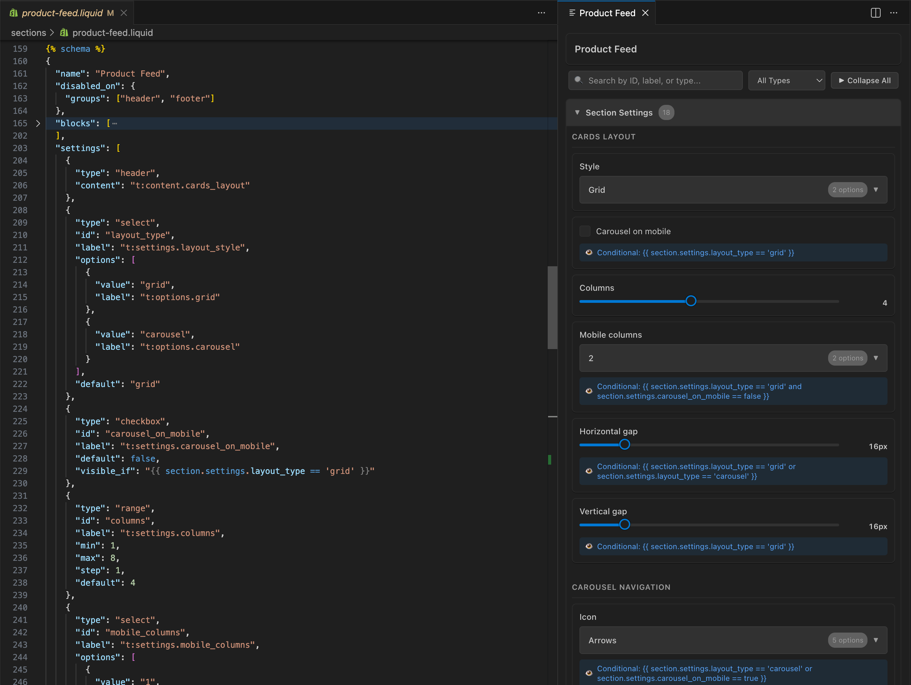

# Shopify Schema Preview

Visual preview of Shopify schema settings directly in VS Code.

[Features](#features) | [Installation](#installation) | [Usage](#usage) | [Configuration](#configuration)

## Features

- **Section schema preview** - Visualize `` blocks from `.liquid` files
- **Block definitions** - Preview block settings and their configurations
- **Theme settings** - Preview `config/settings_schema.json` settings
- **Translation support** - Automatic `t:` key resolution from locale files
- **Live updates** - Real-time preview as you edit
- **Schema validation** - Inline error and warning indicators for common issues
- **Search and filter** - Quickly find settings by ID, label, or type
- **Collapsible sections** - Expand/collapse settings groups and blocks
- **Add settings** - Create new settings directly from the preview panel
- **Preset visualization** - View presets with their default values and block configurations
- **Template restrictions** - Display enabled_on/disabled_on template constraints

## Installation

Search for "Shopify Schema Preview" in the VS Code Extensions marketplace.

## Usage

1. Open a Liquid file with a `` block or `settings_schema.json`
2. Click the preview icon in the editor toolbar
3. Or use `Cmd+Shift+P` (Mac) / `Ctrl+Shift+P` (Windows/Linux) and run "Shopify: Preview Schema Settings"

The preview panel updates automatically when you edit or switch files.

### Adding New Settings

Hover over any setting in the preview panel to reveal a "+" button. Click it to open a form where you can create a new setting with:
- Setting type (text, select, range, checkbox, etc.)
- ID and label
- Default value
- Conditional visibility (visible_if)
- Type-specific options (min/max for range, options for select)

The new setting is inserted directly into your schema file with proper formatting.

### Navigation

Click on any setting in the preview to jump to its location in the source file.

## Configuration

| Setting | Default | Description |
|---------|---------|-------------|
| `shopify-schema-preview.autoSuggest` | `true` | Auto-suggest preview when schema detected |

## Supported Setting Types

**Basic Input:** text, textarea, number, range, checkbox, radio, select

**Specialized:** color, color_background, color_scheme, color_scheme_group, font_picker, image_picker, video, video_url, url, richtext, inline_richtext, html, liquid

**Resource Pickers:** product, product_list, collection, collection_list, page, blog, article, link_list, metaobject, metaobject_list

**Layout:** header, paragraph

## License

MIT
